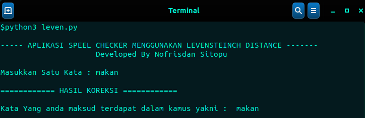
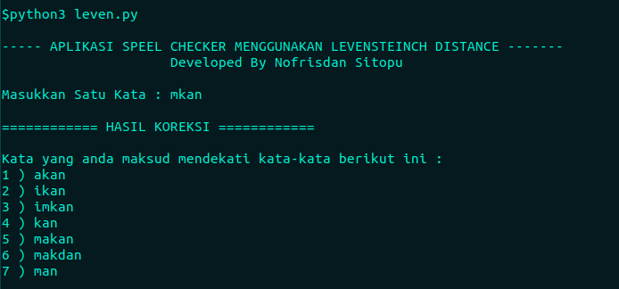

:warning: **Harap izin terlebih dahulu jika ingin menggunakan aplikasi ini, budayakan menghargai karya orang lain, silahkan izin dengan menghubungi nofrisdansitopu22@gmail.com**:

# Tentang Aplikasi

<p>
    Aplikasi Speel Checker merupakan salah satu aplikasi yang berfungsi untuk memeriksa apakah suatu kata yang di inputkan sesuai dengan kamus data yang dijadikan sebagai parameter, metode pencarian menggunakan metode levensteinch distance yang dimana berfungsi untuk memeriksa jarak antar dua buah string
    </p>

# Teknologi yang digunakan

<ol>
<li>Python</li>

</ol>

# Cara Instalasi

<p> 
Untuk install aplikasi silahkan jalan perintah berikut ini 
</p>

```
git clone https://github.com/Nofrisdan/Aplikasi-speel-checker.git

```

# Cara Menggunakan Aplikasi

## Masuk ke directory aplikasi

```
cd Aplikasi-speel-checker
```

## Run Aplikasi

```
python3 leven.py
```

# Gambar Aplikasi

## Kata ketika terdapat didalam kamus parameter



## Kata ketika mengalami typo


